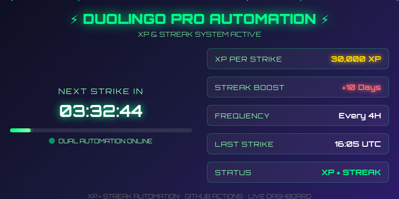

# ⟹⚡⟸ DUOLINGO PRO AUTOMATION ⟹⚡⟸

```
██████╗ ██╗   ██╗ ██████╗     ███████╗███████╗████████╗██╗   ██║██████╗ 
██╔══██╗██║   ██║██╔═══██╗    ██╔════╝██╔════╝╚══██╔══╝██║   ██║██╔══██╗
██║  ██║██║   ██║██║   ██║    ███████╗█████╗     ██║   ██║   ██║██████╔╝
██║  ██║██║   ██║██║   ██║    ╚════██║██╔══╝     ██║   ██║   ██║██╔═══╝ 
██████╔╝╚██████╔╝╚██████╔╝    ███████║███████╗   ██║   ╚██████╔╝██║     
╚═════╝  ╚═════╝  ╚═════╝     ╚══════╝╚══════╝   ╚═╝    ╚═════╝ ╚═╝     
```

<details open>
<summary><b>📊 LIVE DASHBOARD</b></summary>



*Real-time animated dashboard • Auto-updates every 4 hours • Live countdown and particles*

**Dashboard Features:**
- ⏱️ **Live Countdown Timer** - Shows exact time until next automation
- 📊 **Progress Animation** - Visual progress bar with glow effects  
- ✨ **Floating Particles** - Animated cyberpunk background
- 🎯 **Real-time Stats** - XP amounts, streak info, and status
- 🔥 **Dual Automation** - Both XP gain and streak maintenance

*Last Updated: 2025-05-25 16:32 UTC

</details>

<details>
<summary><b>⚙️ AUTOMATION FEATURES</b></summary>

- 🎯 **Automated XP Gain** - 30,000 XP every 4 hours
- 🔥 **Streak Maintenance** - +10 days streak boost every 4 hours  
- ⚡ **Dual Strike System** - XP and Streak in one automation
- 🕐 **Precise Timing** - Runs at :05 minutes (1:05, 5:05, 9:05, etc.)
- 🎮 **Manual Trigger** - Execute immediately via GitHub Actions
- 📊 **Live Dashboard** - Animated GIF updates automatically
- 🚀 **Zero Maintenance** - Set it and forget it

</details>

<details>
<summary><b>🔧 SETUP GUIDE</b></summary>

1. **Fork this repository** to your GitHub account

2. **Add repository secret:**
   ```
   Name: DUOLINGO_TOKEN
   Value: your_duolingo_pro_api_token_here
   ```

3. **Enable GitHub Actions:**
   - Go to Actions tab in your forked repo
   - Click "I understand my workflows, go ahead and enable them"

4. **Activate workflows:**
   - Click on "XP Automation" workflow
   - Click "Enable workflow"

5. **Test immediately (optional):**
   - Click "Run workflow" → "Run workflow"
   - Watch the live dashboard update!

✅ **That's it!** Your automation is now active and the dashboard will update automatically.

</details>

<details>
<summary><b>📂 PROJECT STRUCTURE</b></summary>

```
duolingo-pro-automation/
├── .github/
│   └── workflows/
│       ├── xp-automation.yml     # Main automation workflow
│       └── streak-automation.yml # Streak maintenance workflow
├── dashboard.html                # Interactive HTML dashboard
├── dashboard.gif                 # Auto-generated animated dashboard
├── dashboard.png                 # Static fallback image
├── package.json                  # Node.js dependencies
└── README.md                     # This file
```

</details>

<details>
<summary><b>🎨 DASHBOARD TECHNOLOGY</b></summary>

The animated dashboard uses cutting-edge web technologies:

- **HTML5 Canvas** - Smooth animations and effects
- **CSS3 Animations** - Glow effects, particles, and transitions
- **JavaScript** - Real-time countdown and progress calculations
- **Puppeteer** - Automated screenshot capture
- **GIF Encoding** - Converting frames to animated GIF
- **GitHub Actions** - Automated generation and deployment

**Animation Features:**
- 🌟 Floating particles with random movement
- ⚡ Pulsing glow effects on text and elements
- 📊 Animated progress bars with gradient fills
- ⭐ Status indicators with heartbeat animation
- 🎯 Real-time countdown with millisecond precision

</details>

<details>
<summary><b>⚙️ TECHNICAL SPECIFICATIONS</b></summary>

| Feature | Specification |
|---------|---------------|
| **Automation Frequency** | Every 4 hours |
| **XP Per Strike** | 30,000 XP |
| **Streak Boost** | +10 days |
| **Dashboard Update** | Every automation run |
| **GIF Frame Rate** | 10 FPS |
| **GIF Duration** | 5 seconds (50 frames) |
| **Dashboard Size** | 800x400 pixels |
| **Timezone** | UTC |

**Execution Times (UTC):**
- 01:05, 05:05, 09:05, 13:05, 17:05, 21:05

</details>

<details>
<summary><b>🚀 ADVANCED USAGE</b></summary>

**Manual Execution:**
1. Go to Actions tab
2. Select "XP Automation" 
3. Click "Run workflow"
4. Dashboard GIF updates automatically

**Monitoring:**
- Check Actions tab for execution logs
- Watch dashboard GIF for visual status
- View commit history for automation timestamps

**Customization:**
- Edit `dashboard.html` for different styling
- Modify automation amounts in workflow files
- Adjust GIF generation settings in workflow

</details>

<details open>
<summary><b>⚠️ IMPORTANT DISCLAIMER</b></summary>

```diff
- This project is NOT affiliated with Duolingo
- Use at your own risk and responsibility
- Ensure compliance with Duolingo's Terms of Service
- Educational and demonstration purposes only
```

**Ethical Usage:**
- Respect rate limits and API guidelines
- Don't abuse the automation system
- Use responsibly and moderately

</details>

---

<div align="center">

**🔥 AUTOMATION STATUS: ACTIVE 🔥**

*Powered by GitHub Actions • Built with ❤️ • Open Source*

</div>

---

<!-- 
ASCII Art Generated: http://patorjk.com/software/taag/#p=display&f=ANSI%20Shadow
Dashboard Technology: HTML5 + CSS3 + JavaScript + Puppeteer + GIF Encoding
-->
